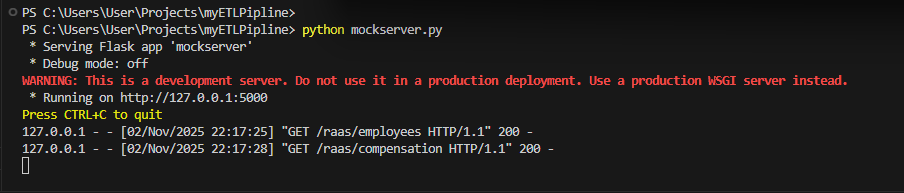
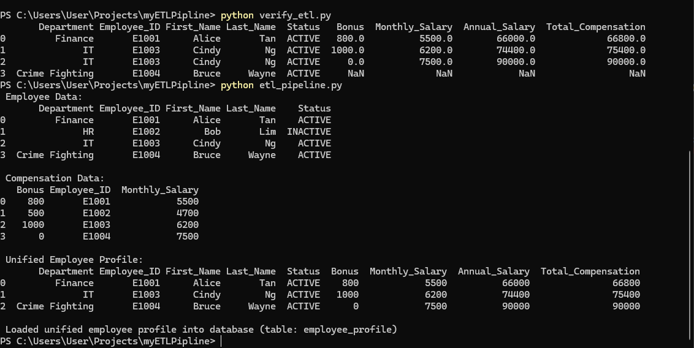
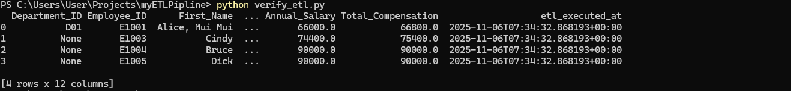

## ETL Pipeline

This repository contains a small ETL (Extract, Transform, Load) pipeline implemented in Python.

Files of interest
- `etl_pipeline.py` — main ETL pipeline script.
- `mockServer.py` — lightweight mock server used to provide test data or simulate upstream services.
- `verify_etl.py` — verification / smoke-test script that checks ETL output.
- `requirements.txt` — Python dependencies.
- `data/` — output data used by the pipeline.

Overview
--------
The pipeline reads input data (from local files or a mocked endpoint), performs lightweight transformations, and writes output files into the `data/` directory. The included `mockServer.py` can be used during development to simulate external APIs.

Prerequisites
-------------
- Python 3.8+ installed
- Windows PowerShell (this README shows PowerShell commands)

Quick start (PowerShell)
------------------------
1. Open PowerShell and change to the project directory:

```powershell
cd C:\Users\User\Projects\myETLPipline
```

2. Create and activate a virtual environment (recommended):

```powershell
python -m venv .venv
.\.venv\Scripts\Activate.ps1
```

If your PowerShell policy blocks activation, you may need to allow script execution for the current session:

```powershell
Set-ExecutionPolicy -ExecutionPolicy RemoteSigned -Scope Process
```

3. Install dependencies:

```powershell
pip install --upgrade pip
pip install -r requirements.txt
```

Running the mock server
-----------------------
Use the mock server when you want to simulate external data sources:
python mockServer.py


By default the mock server prints startup messages and listens on a local port (check the script for exact port and endpoints). Leave it running in a separate PowerShell window while you run the pipeline if needed.


Run the ETL pipeline
--------------------
After dependencies are installed (and mock server is running if you need it), run:
python etl_pipeline.py

This will execute the ETL steps and write outputs to the `data/` folder.

Verify ETL results
------------------
Run the verification script to perform basic checks on outputs:
python verify_etl.py


This script performs simple smoke tests (existence of output files). 
Project structure
-----------------
output files under `data/`.

Notes and troubleshooting
-------------------------
- If you see missing-dependency errors, confirm you activated the virtual environment and installed `requirements.txt`.
- If the mock server port is in use, change the port inside `mockServer.py` or stop the process using that port.
- For long-running development work, consider using an IDE run configuration or PowerShell terminal tabs to run server/pipeline/verify concurrently.


